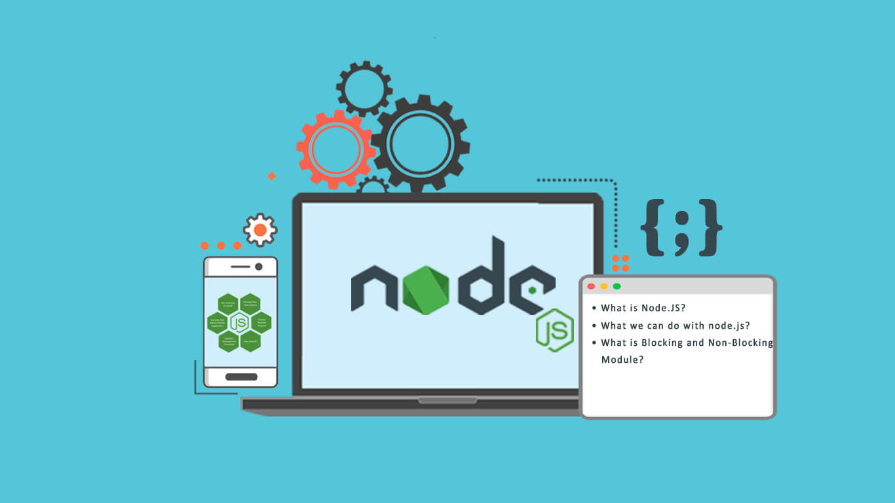
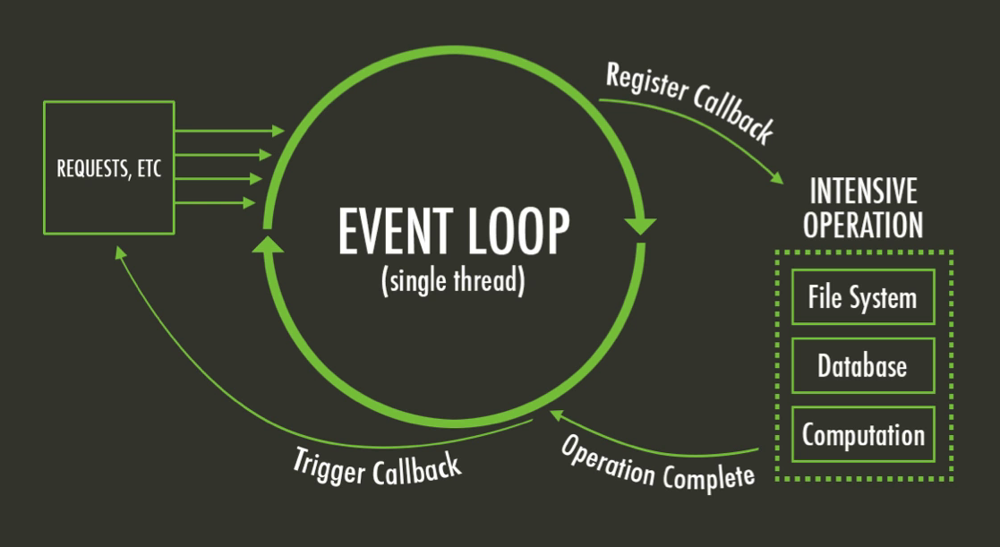
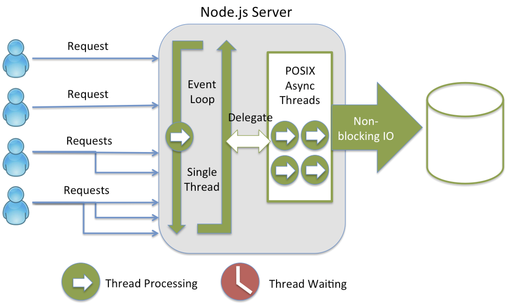
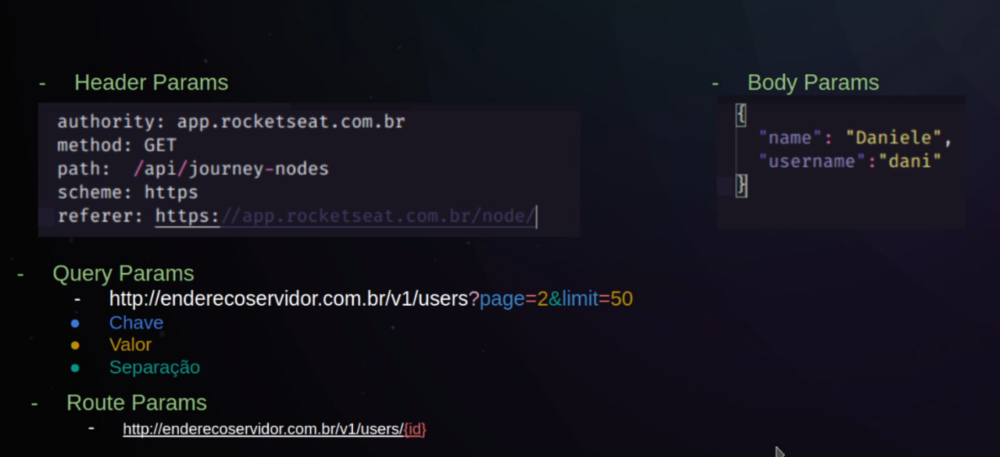

---

  ## O que é o Node ? 
 

  * **Plataforma** `Open-SourceP` que permite a **execução** da linguagem `JavaScript` do lado do **servidor**.

  * `V8 + Libuv + Conjunto de Módulos` (pacotes)
---

  ## Características  

  * Arquitetura Event Loop | Call Stack 
   

  * Single - Thread 
  

  * Non-Blocking ***I/O***

---
  ## Gerenciadores de Pacotes do NodeJs  

  ### NPM e YARN

  ***Instala bibliotecas de terceiros***
  ***Disponibiliza bibliotecas***
---

  ## Fameworks

  * Express
  * Egg.js
  * Nest.js
  * Adonis.js

---

  ## Métodos de Requisições - HTTP Verbs

  **GET ->**
  
    Leitura(listas)
  
  **POST ->**
  
    Criação de Informações
  
  **PUT ->**
  
    Atualizar Informações
  
  **PATCH ->**
    
    Atualização Parcial de Informações
  
  **DELETE ->**
    
    Deletar Informações

  ## HTTP Codes

  **`1xx- Informativo`**

    100:
      A solicitação foi aceita ou o processo continua em andamento.
    
  **`2xx - Retorna Confirmações`**
  
    200: 
      `Requisição bem sucedida.`
    
    201:
      `Created - Geralmente retornado por um post para confirmar uma inserção.`
  
  **`3xx - Indica informações de Redirecionamentos`**
    
    301:
      `Moved Permanenty`
    301:
      `Moded`
 

  **`4xx - Erro do Cliente`**
  
    400:
      `Bad Request.`
    
    401:
      `Unauthorized.`
    
    403:
      `Forbidden.`
    
    404:
      `Not Found.`

    405:
      `Unprocessable Entity.`

  **`5xx - Erros no Servidor | O Servidor falhou ao concluir a solicitação`**

    500:
      `Internal Server Error.`

    502:
      `Bad Gateway.`

---
  ## Tipos de parametros
  
  

---

--- 
  PROJETO NODEJS
  -> Colocar Link para o README.md (api/readme.md)

---