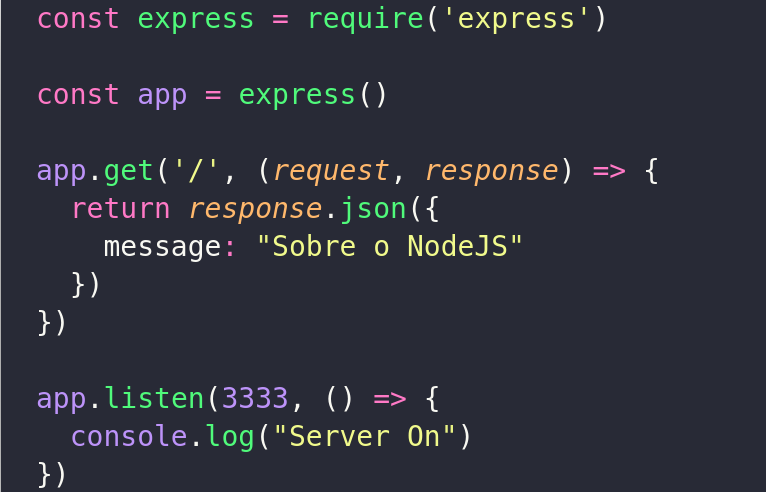
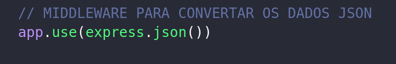
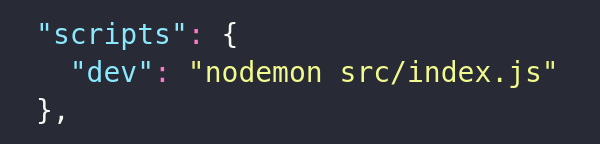
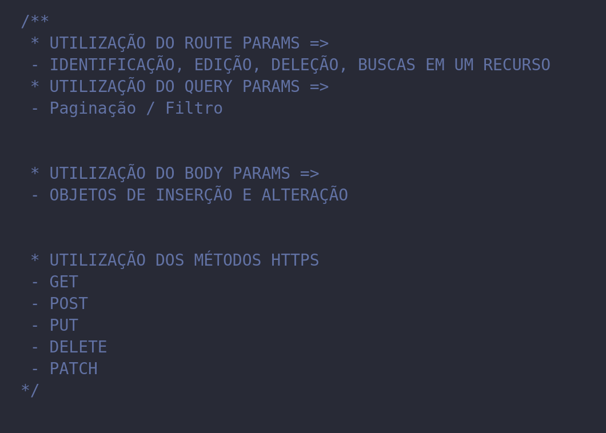
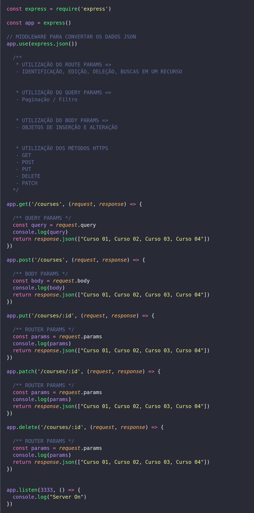
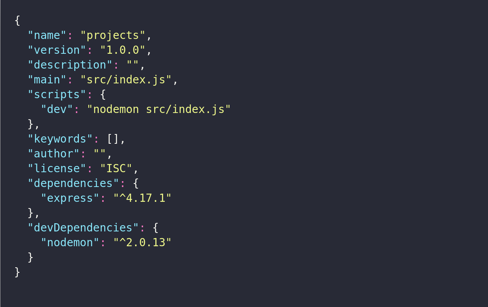

## 1. Servidor NodeJs com *`Framework Express`*
   

  * Instância o Express.
  * Excuta o Servidor na porta `3333`.
  * Utiliza o `*VERBO GET*` do  `*HTTPS VERBS*`

## 2. Middlware - *`Conversão para JSON`*
  
  O Meddlware utilizado pelo Express para entender as requisições em formato JSON

  

## 3. Biblioteca - *` Nodemon`*

```bash
  npm install nodemon -D
```
  * Aplicar leitura de código automática no Servidor.
  * Deve-se configurar o scrip no package.json para executar a aplicação.
  
  
## 4. Métodos e Parâmetros - *HTTPS VERBOS | BODY - QUERY E ROUTERS PARAMS*
  _Métodos e parametros utilizados em uma aplicação **NODEJS**_.

  


## 5. Arquivo `index.js`

  * Implementação do Express, Instânciando um servidor na porta 3333.Utilizando os **MÉTODOS** e **PARÂMETROS**.

  

## 5. Arquivo `package.json`

  - SCRIPT E BIBLIOTECAS

  

